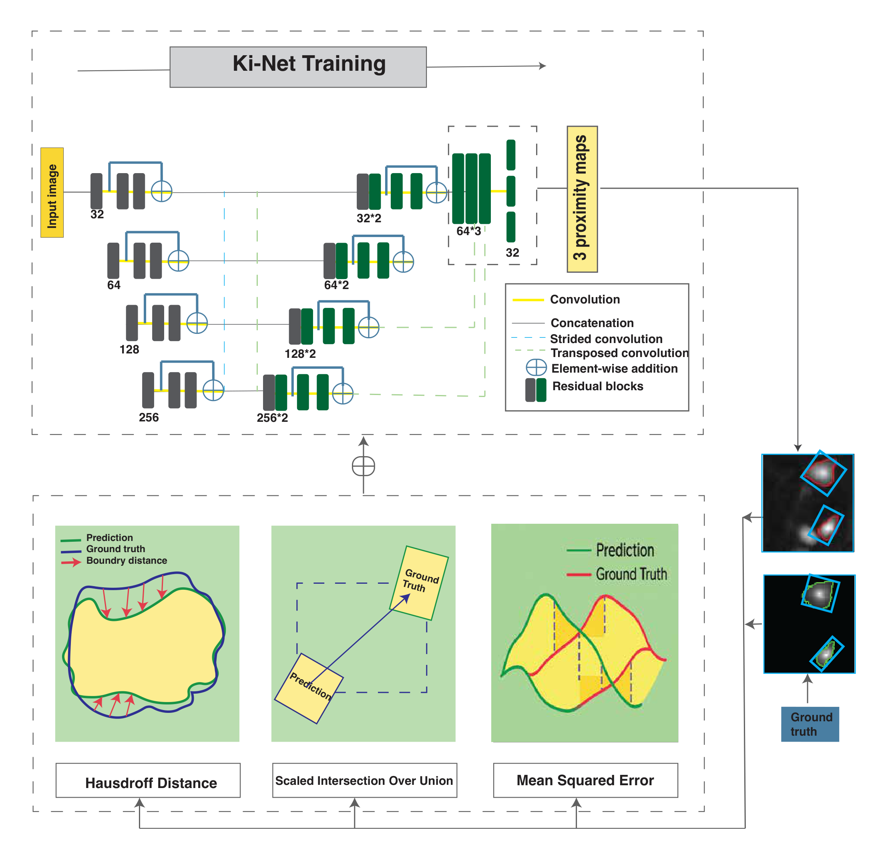

# ShadoNet: A Nucleus Detection and Classification Framework for Ki-67 Pathology Images

<p align="center">
  
</p>

<p align="center">
  <em>
  Overview of ShadoNet. Given a Ki-67 pathology image, the model predicts class-specific proximity maps for nucleus detection and classification while incorporating morphology-aware supervision through rotation-aware SIoU and Hausdorff Distance Transform (HDT) losses.
  </em>
</p>

---

## Overview

**ShadoNet** is a deep learning framework for nucleus detection and classification in **Ki-67-stained histopathology images**.

Unlike conventional nucleus analysis pipelines that separate detection and classification into multiple stages, ShadoNet formulates the problem as a **single-stage structured regression task**. The model predicts class-specific proximity maps that simultaneously encode nucleus location, class identity, and local morphological structure.

To further improve recognition performance, ShadoNet integrates shape-aware supervision derived from the **Segment Anything Model (SAM)** and introduces geometry-sensitive training objectives based on Rotation-aware SIoU and Hausdorff Distance Transform (HDT).

Repository: https://github.com/GhasemiGOF/ShadoNet

## Highlights

- Single-stage nucleus detection and classification
- Shape-aware learning using SAM-generated pseudo masks
- Center-based supervision instead of manual instance segmentation
- Rotation-aware SIoU loss for geometric alignment
- Hausdorff Distance Transform loss for boundary-aware regularization
- Designed specifically for Ki-67 pathology analysis
- Competitive performance across multiple Ki-67 datasets

## Repository Structure

```text
ShadoNet/
├── train_fcn_cell_class.py
├── eval_fcn_cell_class.py
├── Gen_refactored.py
├── train_fcn_cell_class.sh
├── eval_fcn_cell_class.sh
├── requirements.txt
├── requirements-sam.txt
├── README.md
├── assets/
└── nureg/
```

## Datasets

Supported datasets include:

- NETnewClass
- BCD
- PNET

Additional SAM-based and ablation variants are also supported.

## Installation

```bash
git clone https://github.com/GhasemiGOF/ShadoNet.git
cd ShadoNet

conda create -n shadonet python=3.10 -y
conda activate shadonet

pip install -r requirements.txt
```

## Optional: SAM-Based Label Generation

Create `requirements-sam.txt`:

```text
# Optional: Segment Anything pseudo-label pipeline (Gen_refactored.py)
# Install core dependencies first, then this file:
#   pip install -r requirements.txt
#   pip install -r requirements-sam.txt
#
# Download SAM checkpoints (e.g. sam_vit_h_4b8939.pth) and set paths in Gen_refactored.py.

segment-anything @ git+https://github.com/facebookresearch/segment-anything.git
```

Install:

```bash
pip install -r requirements-sam.txt
```

## Generate Shape-Aware Labels

```bash
python Gen_refactored.py datasets/NETnewClass cuda:0 --strategy sam_full
```

Available strategies:

- no_sam
- raw_sam
- sam_all
- sam_area
- sam_geom
- sam_full
- sam_cell_p20
- sam_cell_p40
- sam_cell_p60
- sam_cell_p80

## Training

```bash
bash train_fcn_cell_class.sh
```

or

```bash
python train_fcn_cell_class.py
```

## Evaluation

```bash
bash eval_fcn_cell_class.sh
```

or

```bash
python eval_fcn_cell_class.py /path/to/checkpoint.pth
```

## Citation

```bibtex
@article{ghasemi2025shadonet,
  title={ShadoNet: A Nucleus Detection and Classification Framework for Ki-67 Pathology Images},
  author={Ghasemi, Mahsa and Xing, Fuyong and Cornish, Toby C and Ghosh, Debashis and Bian, Jiang and Zhang, Xuhong},
  journal={Bioinformatics},
  year={2025}
}
```

## Contact

**Xuhong Zhang**

zhangxuh@iu.edu
